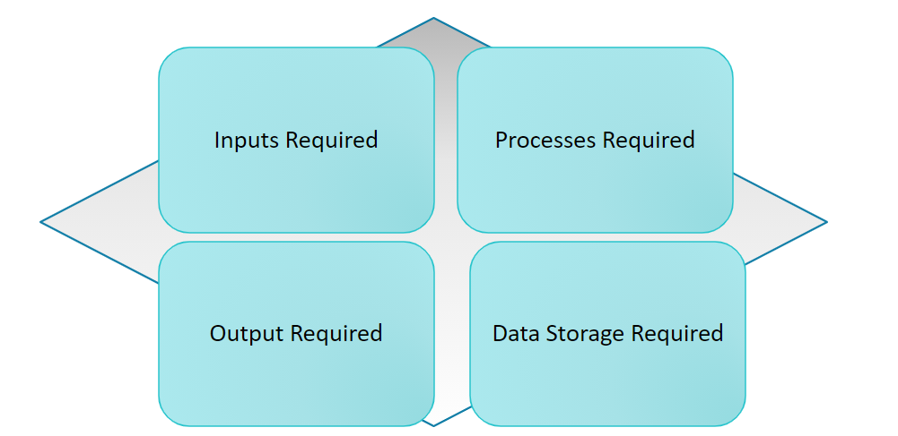

# Algorithm thinking

Algorithm thinking is a way of getting a solution through the clear definition of the steps needed. Agorithms are used to help write code that is logical, meets the need of the clients, areefficient an less likely to have problem.

---

## How to Create an Algorithm

+ Steps 1: Understand the problm - What are you trying to solve.

+ Step 2: Identify the inputs – What values with entered by the user? What type of data will this be?​

+ Step 3: Identify the processes – What kind of calculation are involved.​

+ Step 4: Identify the data storage required – Data together in a list or individual in variables​.

+ Step 5: Identify the outputs – What information must be stored​.

+ Step 6: Used a quad diagram to collect your notes.​

---

## Quad Diagram

Quad diagram can be used to organise and collate information/thoughts when carrying out algorthmic thinking.

---

## Importance

Why is algorithmic thinking important in the creation of a program and for the programmer

 > 1. Organised approached to solving the problem
 > 2. Focuses on solving the problem quickly
 > 3. Potential problems can be identified early
 > 4. Missed steps are easier to identify