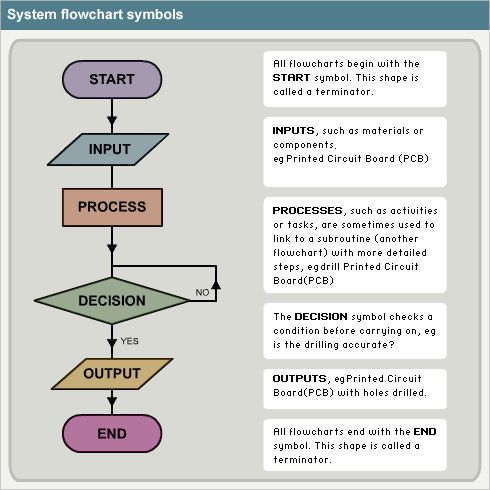

## Flowcharts

To be able to create a meaningful flowchart, an [algorithm](algorithm.md) must first be created. [Algorithm](algorithm.md) can be developed into Pseudocode. This takes each step and revises them into a from called structured.

The **Step-by-step instructions** used to solve a problem can be used to create a diagram which is called **Flowchart**. It uses symbol to represent the different types of instructions. The flowchart symblos are linked togheter with arrows showing the direction of flow.



---

## Pseudocode

The algorithm can then be taken and be changed into pseudocode. This is fake programming language. 

> It does not hvae any computing commands. 
> It helps you to think through the problem and ensure that the solution work.

Before pseudocode can be written some basic programming concepts need to be understood.

| Command | Description   |
| :--- | :--- |
| **Variable**   | storage mechanism where the data can change be updated for example results of calculation |
| **Constants** | storage mechanism where data that does not change through the running of a program |
| **Key processes** | if statements, calculations |
| **Repeated process** | loops used to repeat specific parts of a program |
| **Inputs** | these are inputs into the program, this can be from the keyboard or mouse, etc...| 
| **Outputs** | these are outputs to the screen |

Pseudocode must be laid out in a particular way. The code must be **indented**. This means that it must be tabbed across the page.

> Think of indentation as a replacement for brackets like in math's.
> It means one set code is related to the outer set.

 Example 1

```js
BEGIN
    SET age
    INPUT age
    IF age is greater than 17
        DISPLAY you can vote.
    ELSE
        DISPLAY you cannot vote.
        SET vote
        END IF
END
```
Example 2

```js
{
SET age​
INPUT age​
IF age is greater than 17​
DISPLAY you can vote.​
ELSE​
DISPLAY you cannot vote.​
SET Vote​
}
```

Which is easier to read?

- [x] Example-1  
- [ ] Example-2

---

### How to Write Pseudocode

| Command | Execute | Description |
| :--- | :---: | :--- |
| ```Start/End```| **BEGIN and END** | Used to show the start of the program and the end of the program |
| ```Input``` | **INPUT, READ or OBTAIN** | This is anything entered into the program |
| ```Outputs``` | **PRINT or DISPLAY** | This is to display something to the user or send something to the printer​ |
| ```Processes ``` | **CALCULATE, SUM or GENERATE** | This is carries out an action or task |
| ```Variables ``` | **SET or INITIALISE**  | Initialise a variable to be used to store data or update the data |
| ``` Loop/Iteration``` | **WHILE** <br /> **REPEAT - UNTIL**  | a loop (iteration that has a condition at the beginning)​<br /> a loop (iteration) that has a condition at the end​ |
| ```Decision/Conditional ``` | **IF - THEN - ELSE** | a decision (selection) in which a choice is made​ any instructions that occur inside a selection or iteration are usually indented​ |

---

### Repeats 

Repeat is a command that create a repetiontion for a spcific block of code. This is called "for loop"

```js
{
REPEAT
    DISPLAY Insert card
    INPUT card details
    SET card details
    IF card is invalid
        card not accepted
    ELSE
        card is accepted
UNTIL card is accepted
SET oddNumbers to 0
FOR count = 1 to 10
    DISPLAY count 
    SET count + 2
END FOR
}
```

---

### IF

These use a condition to make a decision

```js
{
IF card is invalid
        card not accepted
    ELSE
    card is accepted
}
```