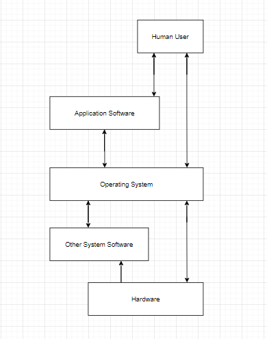
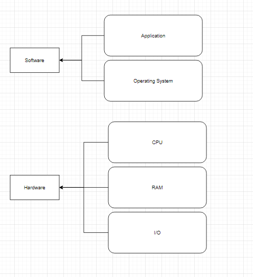
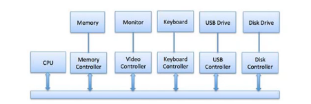

---

title: Operating System
sidebar: 1

---

## Operating System

An Operating System acts as a communication bridge (interface) between the user and computer hardware.
The purpose of an operating system is to provide a platform on which a user can execute programs in a convenient and efficient manner.

An operating System is software that managers the computer hardware.
This is an important function as it ensures the computer system is working appropriately which in turn prevents user programs interfering with that system.

When starting up any device a small program stored in the ROM will take the operating system from the hard drive and place it into the main memory (RAM)? 
This is called **BootStrapping**. 

The main function of the OS:

- Application management
- Input/output management
- Device Drivers
- Memory management
- CPU management
- Hardware

:::info
The most common operating system used are:
- MacOS
- Linux
- Windows
- Android (based on Linux)
- iOS
:::

---

### Operating System - Model

The image below is the standard model of how a operating system works -

---

### Operating System - Application Layer

An OS is the program that, after being initially loaded into the computer by a boot program, manages all of the other application programs in a computer. 
The application programs make use of the operating system by making for services through a denied application program interface

The application layer provides services for an application program to ensure that effective communication with another application program on a network is possible. 
The application player should not be thought of as an application as most people understand it.

The application layer is a component within an application that controls the communication method to other devices.

### Operating System - Input and Output

One of the important jobs of an OS is to manage various i/o devices such as mouse, monitor

An I/O system is required to take a request from an I/O and send it to the physical device, 
then take whatever repones comes back from the device and send it to the application

I/O device can be divided into two categories:
- Block device – which the driver communicates by sending entire blocks of data
- Character device – which the driver communicates by sending and receiving single character

### Operating System - Device Controller

An OS manages device communication via their respective driver.
It does the following activities for device management-

- Keeps of all device. Program responsible for this task is known as the I/O controller
- Decides which process gets the device when and for how much time
- Allocates the device in the efficient way
- De-allocates devices

:::note
Device drivers are software modules that can be plugged into an OS to handle a particular device.
OS takes help from device drivers to handle all I/O devices.
:::

The Device controller works like an interface between a device and a device driver. I/O devices such as keyboard, monitor, etc. 
Have a mechanical component and an electronic component where the electronic component is called the device controller. 

There is always a device controller and a device for each I/O device to communicate with the Operating System. 
A device controller may be able to handle multiple devices at one time.

Any device connected to the computer is connected by a plug and socket, and the socket is connected to a device controller.

Below is a model for connecting the CPU, memory, controllers, and I/O devices where CPU and device controllers all use a common bus for communication

### Operating System - Memory Management

Memory management is the functionality of an operating system which handles or manages primary memory and 
moves processes back and forth between main memory and disk during execution.

Disk execution is also known as  daemon and is a process that runs in the background of a multitasking operating system to monitor services and 
perform administrative changes.

Memory management keeps track of each and every memory location, regardless of either it is allocated to some process, or it is free. 
It checks how much memory is to be allocated to processes. It decides which process will get memory at what time and tracks whenever some memory 
gets free or unallocated and correspondingly it updates the status.

### Operating System - File Management

A file system is created to organize files and directories. This gives programs a consistent way to store and retrieve data.
The OS is also responsible for the naming, sorting, deleting, moving and copying of files (at the request of the user).

A file system is normally organised into directories for easy navigation and usage. 
These directories may contain files and other directions. An Operating System does the following activities for file management:

- Keeps track of information, location, uses, status etc. The collective facilities are often known as file system.
- Decides who gets the resources.
- Allocates the resources.
- De-allocates the resources.

### Operating System - Additional Features and Functionality 

Additional functions that are controlled within the operating system include:

- Security
- Add and removing programs
- Appearance 
- Network and Internet
- User accounts
- Accessibility 

---

## Types of Software

There are three main types of software used on either a PC system or a device this includes application software, utility software and security software.

Application software enables the user to interact with their computer systems to perform different functions, this may include work activities or leisure activities.
Application software can come in many different forms some examples of application software are:

- Microsoft word 
- Microsoft excel
- Internet browsers
- Apps if you are using a mobile device 

### Utility Software

Utility software runs along side the operation system to carry out routine tasks of maintenance and optimise the system operations.

Utility software is there to add features and functionality to the operating  system and to help the computer to remain running in the best health.

:::info
Another useful utility software is to gather information to clean up a system and speed up its performance this is done by searching for junk data and removing it.  
This frees up storage space utility software varies in the amount of memory that it may take up and will depend greatly on the features Included.

The purpose of utility software is to undertake routine tasks on your PC or device.  The types of tasks utility software undertakes are:
- Security checks
- Identifying and removing viruses
- Cleaning up files
- Software updates 
- Backing up data 
- Managing peripheral devices such as; cameras, printers, webcam's, etc…
:::
---

## The Kernel - The Hub

 

The lowest layer of the OS:

- Nucleus
- Controls the whole system

Responsible for:
- Multi-Tasking
- Process Control/Scheduling
- Exeption Handling
- Interrupt Processing

 

The Kernel is the centre or core part of the operating system and is used to control and manage both the components and the
tasks.

The role of the Kernel includes control and management of the following components and tasks:

- **Program execution** – To load software, allocate resources, run and terminate when finished
- **Interrupts** – For components such as amount to request servicing by the CPU
- **Modes** – To switch between user modes, to run apps and system mode , to run low level code that the operating system needs for operating such as reading memory
- **Memory management** – Needed to allocate RAM to running programmes and to reuse RAM when programmes end 
- **Multi-tasking** – To allocate enough CPU and peripheral time to every running programme so that they work concurrently 
- **Disc access** – To read from right to when backing up storage 
- **File Systems** – To control how data is stored and organised 
- **Device Drivers** – To allow the operating system to communicate with the hardware such as graphics cards and sound cards 

