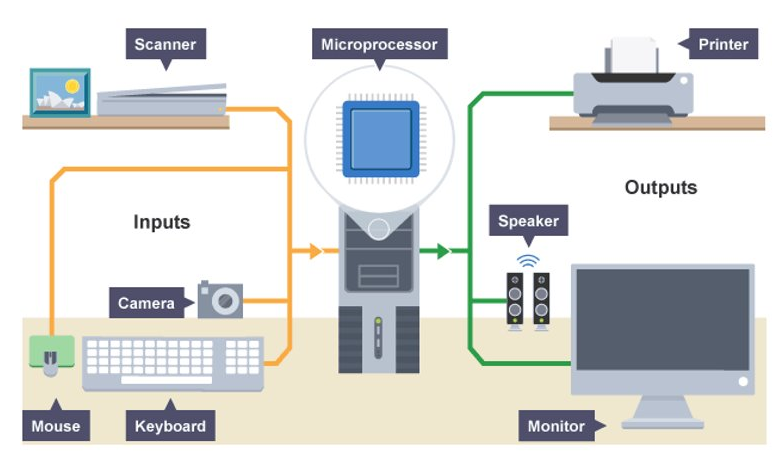

---

title: Output Device
sidebar: 1

---

## Output Device

An input device is a computer peripheral that is used to provide data and control signals to an information processing system.

### Monitor

A monitor consists of a screen, circuitry, a power supply, buttons to adjust screen settings, and a casing that contains all these components.

A monitor displays data from a computer onto a screen so the user can interact with the data via a digital interface.

:::info
The first monitors used the same technology as early televisions, relying on a cathode ray tube and a fluorescent screen.

This technology was first utilised for computer monitors in 1965 in the Uniscope 300 machine, which had a built-in CRT display.
:::

### Printer

The function of a printer is to create a copy of whatever is sent from the computer to the printer. 
Printers take electronic data sent from a computer and generate a hard copy.

:::info
Modern day printing was invented in 1938 by Chester S Carlson of Queens in New York.

The first inkjet printer was developed in 1951 and the most common types of printer we use today are ink jet printers or laser printers.

Printers are an output device that originally connected to a computer  using parallel ports and now you now connect using a USB or Wi-Fi.
:::

### Headphones

Headphones are an output device that are used to hear sound  by a single listener usually attached a computer or any other listening device. 
Also known as earphones, headphones allow you to listen to audio without disrupting others.

:::info
Headphones first became popular for mainstream use in 1979 by Sony Walkman but were first used by the military as early as 1910. 

Headphones come in all shapes and sizes, from basic earbuds to the traditional style with padding around the earpieces. 
They can also connect to your chosen device using either a wired or wireless connection.
:::

### Speaker

Speaker receive audio input from the computer's sound card and produce audio output in the form of sound waves. 
Speakers create sound using internal amplifiers that vibrate at different frequencies according to data from the computer. This produces sound.

:::note
Speakers are essential if you want a louder sound, surround sound, fuller bass, or just higher quality audio.
:::

:::info
The first internal computer speaker (a speaker inside the chassis of a laptop) was created in 1981 by IBM.

External computer speakers began to appear in stores in the early 1990s when computer gaming, digital music, and other forms of media became popular. 
Some computer speakers are wireless nowadays, connecting to the computer via Bluetooth.
:::

### Projector

A projector is an output device that "projects"  images onto a large surface, such as a white screen or wall. 
It may be used an alternative to a monitor or television when showing video or images to a large group of people.

It does this by projecting rays of light through a system of lenses which then projects slides or films onto a screen.

:::info
In the early 1920s, filmstrips were used to show “films” in classrooms. Turning the knob allowed teachers to stop on specific slides.

Projectors can connect to the computer via an HDMI (high-definition multimedia) cable or VGA (video graphics array) cable.
:::

### Braille Reader

A braille reader is an output device that uses the kinetic nature of the piezoelectric-driven keyboard to 
send braille letters in the form of raised bumps to the user.

Braille readers come in the form of separate devices from a keyboard or as part of a keyboard.

:::note
A braille reader is a peripheral device that enables a blind person to read text displayed on a computer monitor. The text is sent by the computer to the device, 
where it is translated into a braille format and made readable by pushing rounded pins up through a flat surface. 
:::

---

### Example of Input and Output Process

