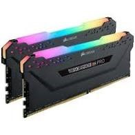

## What are Computer System?

When we use the term "computer" we most often think of a desktop PC, or perhaps a laptop. However, there are many types of computer.

---

## Personal Computers

When referring to a Personal Computer, we refer to laptops, desktops. most computer systems share some internal components. For example, they will have all a motherboard, CPU, RAM and storage.

However, there are differences in these components that make each device unique. These components are a basic physical element that are required to by a computer to enable it to funtion.

### Component of a PC

| Component | Description | Image |
| --------- | ----------- | ----- |
| Motherboard | Motherboard is a circuit board that connect everything to able the components to communicate between them |  |
| Random Access Memory (RAM) | The Random-Access Memory stores temporary data storage while they are in use. When the PC is shut down all the memory will be lost |  |
| Control Proccessor Unit (CPU) | The Central Processor Unit is the main processor that execute instruction to the other components |  |
| Power Supply | The Power Supply is a device that supplies electric power, and this make run the PC |  |
| Graphic Card | The Graphic Card is the component that generate an output image to the display |  |
| Hard Drive | A hard drive is a component that stores data storage such as software or files |  |
| Fan / Heat | A computer fan is fan that make cooler CPU and the PC when is in use |  |
| DVD Drive | A DVD drive is a component to utilize CDs or DVDs and read and write to the CD or DVD drive |  |
| Sound Card | The audio card is a component that produce or reproduce a sound given in output or input |  |
| Network Card | A network card is a component that allow the PC to connect to a network |  |
| CPU Fan | CPU fan is a dedicated fan for the CPU that make cooler while the CPU is in use |  |

